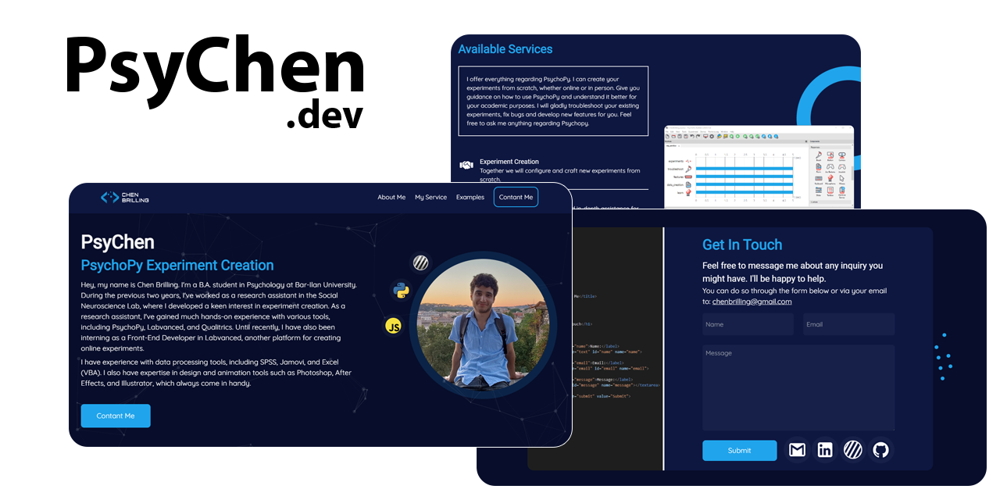

**PsyChen - PsychoPy Experiment Creation**

[PsyChen](https://psychen.dev/) is my personal project/website, where I offer customized PsychoPy experiment creation, troubleshooting, and guidance.
[PsychoPy®](https://www.psychopy.org/) is a free cross-platform package allowing you to run a wide range of experiments in the behavioral sciences (neuroscience, psychology, psychophysics, linguistics...).

## [PsyChen.Dev](https://psychen.dev/)
-----


#### Project Setup

```sh
npm install
```

#### Compile and Hot-Reload for Development

```sh
npm run dev
```

#### Compile and Minify for Production

```sh
npm run build
```

----

- Created with Vue.js and TailwindCSS.
- Deployed with Netlify.
- Created by Chen Brilling.
